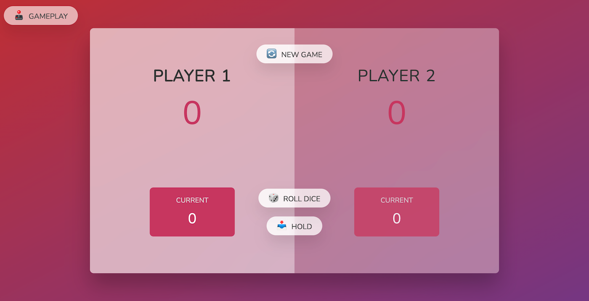

# The Pig Game

## Table of contents

- [Overview](#overview)
  - [Live Preview](#Live-preview)
  - [Screenshot](#screenshot)
- [My process](#my-process)
  - [Built with](#built-with)
  - [What I learned](#what-i-learned)
  - [Continued development](#continued-development)
  - [Acknowledgements](#acknowledgements)

## Overview

### Live preview

[Click Here](https://bhornbhaya.github.io/the-pig-game/)

### Screenshot

### Desktop Version

## My process

### Built with

- HTML5
- CSS
- Javascript

### What I learned

- DOM and DOM Manipulation
- Selecting and manipulating elements
- Handling click events
- Implementing the game logic
- Refactoring code: The DRY principle

### Continued development

- Save high scores and player's name to database
- Allow user to type their names
- Log-in section

### Acknowledgements

This project is a part of the Complete JavaScript Course 2021 by Jonas Schmedtmann

Coded by [me](https://www.linkedin.com/in/bhornbhaya/)
